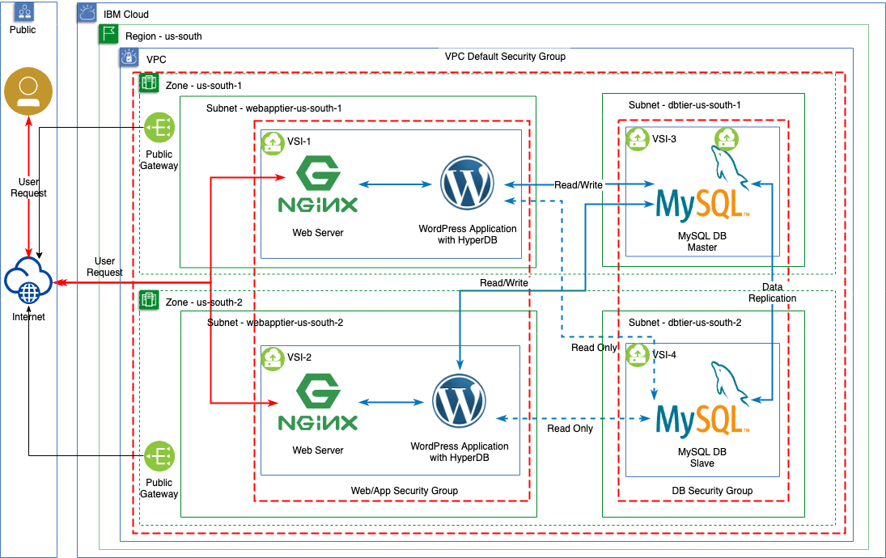

# NExtgen test #2 - Deploying a n-Tier Web App in a NG Virtual Private Cloud using REST API & Ansible

## Purpose

The purpose of this test is to prove the readiness of VPC NG to support the deployment of expected workloads using Terraform
and Ansible. 

High Level Architecture

1. Infrastructure
  - Public Cloud isolation using a VPC
  - RFC1918 private bring-your-own-IP addresses
  - Application and data layers deployed on isolated subnets accross different availability zones
  - Network isolation defined logically using Security Groups and ACLs
  - Global DDOS and Global Load Balancing 
  - <s>VPN-as-a-Service to establish remote secure connectivity between on-pream and the VPC</s>
  - SysDig & LogDNA for infrastructure and application monitoring

2. Application
  - A horizontally scaleable web application deployed into a two different availability zones
  - Multiple database servers across two availability zones
  - A master/slave data replication strategy across availability zones

## VPC Architecture
Below is the IBM Virtual Private Cloud (VPC) architecture of the solution showing public isolation for both Application (through a Load Balancer) and data.

### Infrastructure Architecture

### Application Architecture

#### *Not depicted in drawings*

- Cloud Internet Services (GLB function or DNS)
- Management Flows

## Assumptions and Limitations

- At time of testing it is assumed several key as-a-service capabilities are not available (ACL, LBaaS, VPNaaS)
- The solution will implement HTTP only for simplicity.
- A MySQL database server was implemented on Infrastructure versus as-a-service to illustrate both the ability to define logical tiers between subnets as well
as to show the ability to automate deployment and configuration tasks.
- Cloud-init is used for post-provisioning installation of required packages.  Bring-Your-Own-Image (BYOI) is not supported at time of testing.
- Ansible is used for all post configuration tasks.

## Changes made to accommodate missing capabilities

- Python Scripts adapted for generation=2
- All non supported capabilities (LBaaS, VPNaaS, and ACLs) not configured
- Added floating IP's to compensate for lack of VPNaaS
- Added SSH security group rules for public Mgmt IP to compensate for lack of VPNaaS

## VPC Functional Coverage
| Function  | Demonstrated | Notes |
| --------  | ------------ | ----- |
| REST API  |   :white_check_mark:    | generation=2 passed | 
| Ansible Dynamic Inventory | :white_check_mark: | Dynamic Inventory pulls invetory via REST API |
| VPC |  :white_check_mark: | VPC created by API|
| Resource Groups | :white_check_mark: | Assigned, but assumed to be created already. |
| Access Groups | :white_check_mark: | Inherited, but assumed to already be created |
| Subnets | :white_check_mark: | Subnets created succesfully 2 per zone for total of 4|
| Private (RFC1918) IP (BYOIP) | :white_check_mark: | Address prefixes created correctly and assigned to subnets.|
| ACLs | :x: | Not available in NG |
| Security Groups | :white_check_mark:| SG's created correctly and assigned to interfaces|
| Virtual Server Instance (VSI) | :white_check_mark: | Instances created succesfully, though found differences in OS images from VPC Classic |
| Multiple Network Interfaces in VSI | :white_check_mark: | Only primary interface tested |
| Secondary volumes | :white_check_mark: | provisioned and assigned succesfully |
| Load Balancer as a Service | :x: | Not Available, used CIS GLB + NGINX |
| Floating IPv4 | :white_check_mark:| Assigned floating IP's to all instances |
| Public Gateway | :white_check_mark: | Public Gateway allocated and assigned to subnets in each zone |
| Storage BYOI support (both boot and secondary) | :x: |Base OS image with Cloud-Init instead of BYOI |
| Cloud-Init | :white_check_mark: | Found differences with base OS images from VPC classic |
| VPNaaS | :x: | Not available |
| Cloud Internet Services (CIS) | :white_check_mark: | GLB two origins, one for each zone with NGINX destinations for each web server|
| IBM Cloud Monitoring with Sysdig | :white_check_mark: | Tested using public end point |
| IBM Cloud Log Analysis with LogDNA | :white_check_mark:| Tested using public end point |
### System Requirements

#### Operating system

| Tier  | Operating system |
| ------------- | ------------- |
| Web Server & Application | Ubuntu 16.04  |
| Data  | Ubuntu 16.04  |

#### Hardware

| Tier | Type | Profile | Secondary |
| ------------- | ------------- | ------- |
| Web Server and Application  |  VSI |c2-2x4 |  100GB general IOPS |
| Database | VSI  | b2-16x64 | 500GB 10iops-tier |

## Documented Steps

### Prerequisites

The following software needs to be installed:
1. Terraform 0.11 or greater
2. [IBM Cloud Terraform Provider version 0.17.1](https://github.com/IBM-Cloud/terraform-provider-ibm) 
2. Ansible 2.8

The following must be configured prior to running Terraform / Ansible
1. A Public SSH key as described in [SSH Keys](https://cloud.ibm.com/docs/vpc-on-classic-vsi?topic=vpc-on-classic-vsi-ssh-keys#ssh-keys).
2. A resource group called `wordpress-demo` as described in [Managing resource groups](https://cloud.ibm.com/docs/resources?topic=resources-rgs#rgs)
3. User permissions and the required access as described in [Managing user permissions for VPC resources](https://cloud.ibm.com/docs/vpc-on-classic?topic=vpc-on-classic-managing-user-permissions-for-vpc-resources)

### Deploy VPC Infrastructure using Terraform & Ansible

1. [Deploy Infrastructure using Terraform](docs/terraform.md)
2. [Establish site-to-site VPN](docs/vpn.md)
3. [Configure Application Layer using Ansible](docs/ansible.md)

